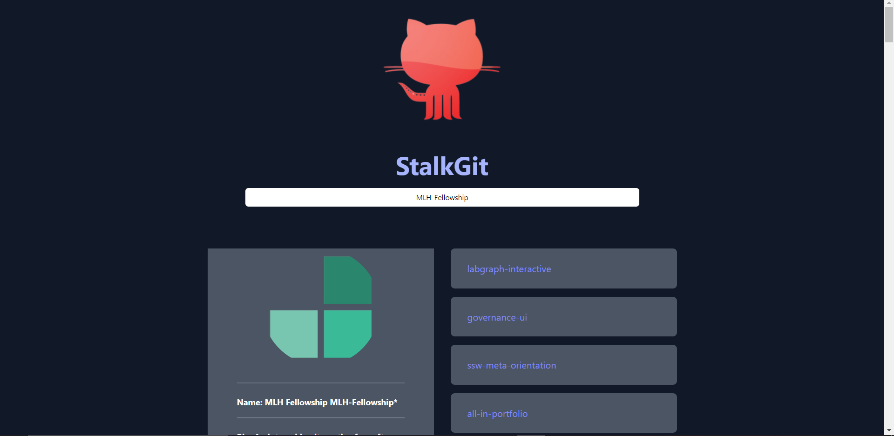
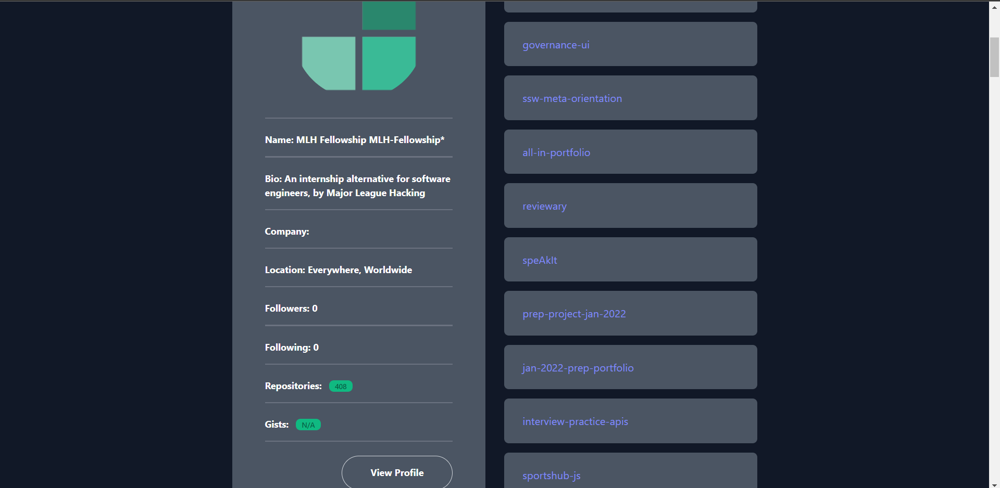

# StalkGit
<h3 style="text-align: center;">Using the GitHub API to help new developers start with their open source journey.
</h3>


# Important Links  
 
- [Link to website]()
- [Demo Video]()

</strong> 

# Application images
## Landing Page




# Inspiration ✨
We see github Users  with more than 500 projects and there were more than 100/200/1000 open issues in each of them, So we think that the platform which helps them to organize the issues and see new ones will be great.Not only for them, but also for open source Contributors, who want to contribute for big repositories.

# What it does 🤖

 StalkGit is a web app that uses GitHub API to fetch user data from the GitHub database and display a user's information including the number of public repositories and other data on the user.
# Key features 💡

## Curent 
For now our demo application contains a single-page web site where it is possible to simply find the users information on Github and all of the users repositories.

## Future plans
As we mentioned , Our purpose is to make an Open-Source developer's life easier. So, on our website besides the current features, we are going to add open issues managemenet system.It will be possible to find a User with some tags (like Language , Datetime, University, Organization, stars etc). Open source developers can find all of the open issues on her/his profile or an organizations page with some filtered options (most common datetime option). So, it will be possible to easily check all of the new issues. 

# Tech Stack 📚

- HTML, CSS, JavaScript
- React
- React-Redux Toolkit
- Tailwind CSS

# Future scope's technical description📈

We are using Gihub API. As of now the API does not have a direct end-point that meet our applications requirement hence the lists obtained after hitting several end-points will have to be filtered out.

## Finding all of the open issues 
 After finding all of the open repositories with :  
 ``` javascript
 const fetchReposAction = createAsyncThunk(
  "repos/list",
  async (user, { rejectWithValue, getState, dispatch }) => {
    try {
      const { data } = await axios.get(
        `https://api.github.com/users/${user}/repos?per_page=700&sort=asc`,

      );
 ``` 
 this request . we need to find all of the open issues inside of them . So we are going to use  allSettled option react. 

 ``` javascript
const promiseArr = allRepos
.map((id) => fetch (`https://api.github.com/users/${user}/${repo}/issues?per_page=700&sort=asc`))

const res = await Promise.allSettled(promiseArr)
.filter(<possible filters with date and repository language and etc>)

 ```
In that way we will find all issues inside repos and write relevant UI/UX for this add on.


